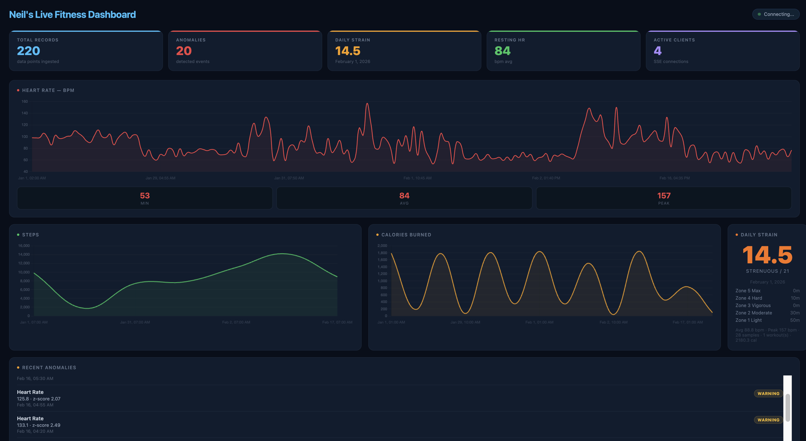

# OpenClaw Fitness Telemetry Platform

A real-time fitness telemetry backend that ingests Apple Watch biometric data, runs sliding-window z-score anomaly detection, and streams results live to a dashboard. Deployed on AWS ECS Fargate with an async ingest queue and SSE bulkhead.



---

## Architecture

```
Apple Watch / iPhone
  Health Auto Export ──── POST /ingest/json ──┐
  Apple Health XML   ──── POST /ingest      ──┤
                                              │
                        ┌─────────────────────▼──────────────────────┐
                        │          Application Load Balancer          │
                        │       fitness-telemetry-alb  (port 80)     │
                        └─────────────────────┬──────────────────────┘
                                              │ round-robin across tasks
                        ┌─────────────────────▼──────────────────────┐
                        │          ECS Fargate — Go/Gin Server        │
                        │                  port 8080                  │
                        │                                             │
                        │  Ingest handler                             │
                        │    └─► IngestQueue.Enqueue()  202 Accepted │
                        │              │                              │
                        │    ┌─────────▼──────────────────────────┐  │
                        │    │  IngestQueue (interface)            │  │
                        │    │   ChannelQueue  — local dev         │  │
                        │    │   SQSQueue      — production        │  │
                        │    └─────────┬──────────────────────────┘  │
                        │              │ Records() channel            │
                        │    ┌─────────▼──────────────────────────┐  │
                        │    │  Worker pool (10 goroutines)        │  │
                        │    │   Store.Add                         │  │
                        │    │   Detector.Detect  (z-score)        │  │
                        │    │   Broker.Broadcast (SSE)            │  │
                        │    └─────────┬──────────────────────────┘  │
                        │              │                              │
                        │    ┌─────────▼──────────────────────────┐  │
                        │    │  MetricStore                        │  │
                        │    │   sync.RWMutex + sorted slices      │  │
                        │    │   binary-search insert O(log n)     │  │
                        │    └────────────────────────────────────┘  │
                        │                                             │
                        │  GET /stream  (SSE)                         │
                        │    └─► bulkhead: max 200 clients            │
                        │         └─► SSEBroker fan-out               │
                        └─────────────────────────────────────────────┘
                                         │ SSE /stream
                        ┌────────────────▼────────────────────────────┐
                        │  Browser Dashboard                           │
                        │  Heart Rate · Steps · Calories · Strain     │
                        │  Live anomaly feed · HR zone breakdown       │
                        └─────────────────────────────────────────────┘
```

---

## Infrastructure

All infrastructure is managed by Terraform in [terraform/](terraform/). A single `terraform apply` builds the image, pushes it to ECR, and provisions every AWS resource.

```
terraform/
├── main.tf              # root: IAM execution role, module wiring, Docker build/push
├── variables.tf         # aws_region, service_name, container_port, ecs_count, ...
├── outputs.tf           # alb_dns_name
├── provider.tf          # AWS + kreuzwerker/docker providers
└── modules/
    ├── network/         # VPC, subnets, IGW, route tables, security groups, ALB, target group
    ├── ecr/             # ECR repository
    ├── ecs/             # ECS cluster, task definition, Fargate service
    └── logging/         # CloudWatch log group (7-day retention)
```

### What each module owns

**network** — VPC `10.0.0.0/16` with two public subnets across separate AZs. Internet gateway and route table give tasks outbound internet. Two security groups: ALB SG (port 80 from `0.0.0.0/0`) and service SG (container port 8080 from ALB SG only). ALB with HTTP:80 listener forwarding to a target group; health checks hit `/health` every 30 seconds.

**ecr** — Private ECR repository (`fitness-telemetry`). The root `main.tf` uses the `kreuzwerker/docker` provider to build the image with `--platform linux/amd64` (required for ECS Fargate from Apple Silicon) and push it on every apply when source files change.

**ecs** — ECS cluster, Fargate task definition (256 CPU / 512 MB by default), and ECS service. Task count is controlled by `var.ecs_count` — set to 1, 2, or 4 to reproduce the horizontal scaling experiments. Tasks run in `awsvpc` networking mode with public IPs; the service registers into the ALB target group automatically.

**logging** — CloudWatch log group `/ecs/fitness-telemetry` with 7-day retention. The task definition ships container stdout/stderr here via the `awslogs` log driver.

### IAM

A single ECS execution role (`fitness-telemetry-ecs-execution-role`) is created in the root and passed to both `execution_role_arn` and `task_role_arn`. It has `AmazonECSTaskExecutionRolePolicy` attached, which covers ECR image pulls and CloudWatch log writes. If you enable SQS, add `sqs:SendMessage` / `sqs:ReceiveMessage` / `sqs:DeleteMessage` to this role.

### Key variables

| Variable | Default | Notes |
|---|---|---|
| `aws_region` | `us-west-2` | |
| `service_name` | `fitness-telemetry` | prefix for all resource names |
| `container_port` | `8080` | |
| `ecs_count` | `1` | scale up for load tests |
| `log_retention_days` | `7` | |

---

## Tech Stack

| Layer | Tool |
|---|---|
| Backend | Go 1.24, Gin |
| Async queue | `IngestQueue` interface — `ChannelQueue` (local) / `SQSQueue` (AWS SQS) |
| Anomaly detection | Sliding-window z-score, window = 200, O(1) running accumulators |
| Real-time streaming | Server-Sent Events (SSE), bulkhead at 200 concurrent clients |
| Data store | In-memory sorted slices + `sync.RWMutex`, binary-search insert |
| Container | Docker multi-stage alpine build, `--platform linux/amd64` |
| Infrastructure | Terraform — ECS Fargate, ECR, ALB, VPC, CloudWatch |
| Load testing | Locust (Python) |
| Data sources | Apple Health XML export / Health Auto Export app (JSON) |

---

## API Endpoints

| Method | Path | Description |
|---|---|---|
| `POST` | `/ingest` | Upload Apple Health XML export — returns `202 Accepted` |
| `POST` | `/ingest/json` | Receive JSON from Health Auto Export — returns `202 Accepted` |
| `GET` | `/stream` | SSE stream of live metrics and anomaly events (max 200 clients) |
| `GET` | `/metrics?type=heart_rate&limit=50` | Query metrics by type and time range |
| `GET` | `/metrics/stats?type=heart_rate` | Min, max, mean, stddev |
| `GET` | `/anomalies` | All detected anomalies with z-scores and severity |
| `GET` | `/strain?date=2026-02-16` | Daily strain score and HR zone breakdown |
| `GET` | `/health` | Server health check |

Ingest endpoints return `202 Accepted` — records are enqueued immediately and processed by background workers. The response body is:
```json
{ "status": "queued", "queued": 42, "dropped": 0 }
```
`dropped` increments when the queue is full (channel buffer = 1024). No processing happens in the request goroutine.

---

## Running Locally

```bash
cd src
go run .
```

Ingest synthetic data:
```bash
python3 gen_xml.py > synthetic_health.xml
curl -X POST http://localhost:8080/ingest -F "file=@synthetic_health.xml"
```

Open dashboard at `http://localhost:8080`.

**Live data from Apple Watch (same WiFi):** install [Health Auto Export](https://apps.apple.com/app/health-auto-export-json-csv/id1115567033), set REST export URL to `http://<your-mac-ip>:8080/ingest/json`, export type individual samples.

---

## Deploy to AWS

Prerequisites: AWS CLI configured, Docker running, Terraform installed.

```bash
cd terraform
terraform init
terraform apply
```

ALB DNS printed on completion:
```
alb_dns_name = "fitness-telemetry-alb-xxxx.us-west-2.elb.amazonaws.com"
```

Point Health Auto Export at `http://<alb-dns>/ingest/json`. Dashboard at the same root URL.

Scale tasks for load testing:
```bash
terraform apply -var="ecs_count=4"
```

Tear down:
```bash
terraform destroy
```

### Optional: SQS queue

Set `SQS_QUEUE_URL` as an environment variable on the ECS task definition to switch from the in-process channel queue to AWS SQS. The server selects the backend automatically at startup — no code change required. Add the SQS permissions to the task role before enabling.

---

## Anomaly Detection

Sliding-window z-score, per metric type, window = 200 readings:

- **Warning** — z ≥ 2.0 (top 2.3% of distribution)
- **Critical** — z ≥ 3.0 (top 0.1% of distribution)

Minimum 10-sample warm-up before detection activates. Running `sum` and `sumSq` accumulators make each detection O(1) — no full window scan. When the window is full, the oldest value is subtracted from both accumulators before the new value is added.

---

## Daily Strain Score

0–21 scale modelled on Whoop. Time in each HR zone weighted by effort multiplier, then log-scaled.

| Zone | % Max HR | Multiplier |
|---|---|---|
| Zone 1 Light | 50–60% | 0.2× |
| Zone 2 Moderate | 60–70% | 0.5× |
| Zone 3 Vigorous | 70–80% | 1.0× |
| Zone 4 Hard | 80–90% | 2.5× |
| Zone 5 Max | 90–100% | 5.0× |
